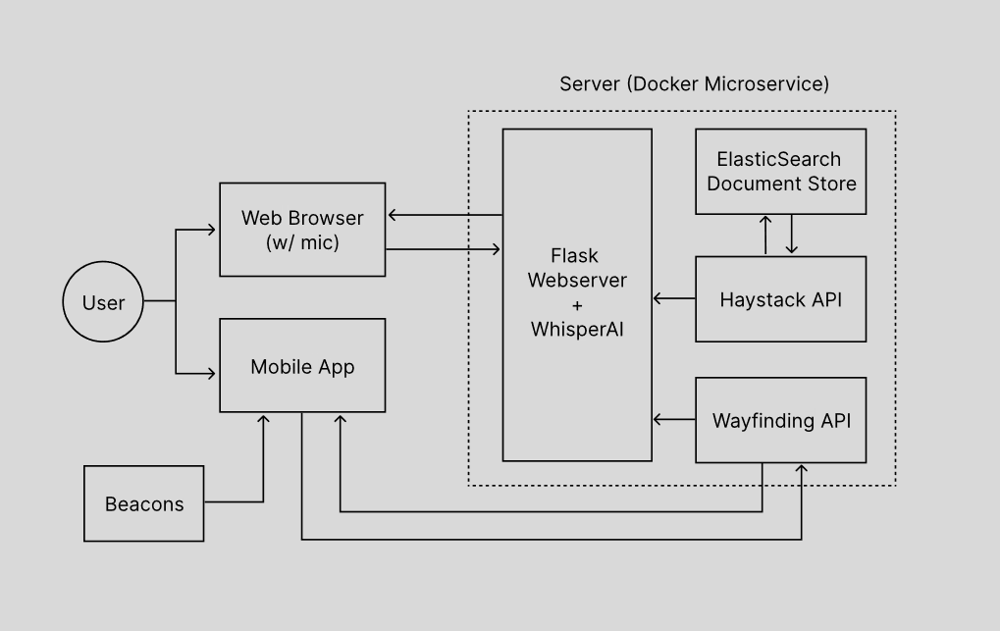

# Smart Receptionist System with Voice Assistant and Indoor Positioning System

This is the Final Year Project for my Computer Engineering degree which uses Natural Language Processing (NLP) for Question Answering and Indoor Positioning for building navigation. All of this is to assist companies with handling guests similar to that of a traditional receptionist.

## Running the System

This system is made out of different Docker containers and can be run using docker-compose command.

``` bash
> docker compose up
[+] Running 0/8
 - elasticsearch 7 layers [⠀⠀⠀⠀⠀⠀⠀]      0B/0B      Pulling                   4.4s 
   - b38629870fdb Pulling fs layer                                             0.6s 
   - 4a2fc9d810b8 Pulling fs layer                                             0.6s 
   - e2926999e93a Pulling fs layer                                             0.6s 
   - 1bfda44c7b09 Waiting                                                      0.6s
   - 901547b54de2 Waiting                                                      0.6s
   ...
```

## How it Works



This system uses the browser as the main interface for the user where they can use voice input(speech-to-text using WhisperAI) to ask question and the HaystackAI(the NLP framework) will output appropriate answer. For the Indoor Navigation, a seperate app was built using Flutter and the waypoint is made using Estimote beacon which connected with the user's phone using bluetooth. This will pinpoint the current location of the user and an algorithm based on the A* algorithm used to determined which path is the best for the user to get to their intended location.

Even thought the system was planned to be a microservice architecture, the dependence on one service to another made it to be a more monolithic architecture that is made up of seperate Docker containers.

## How it performs

The speech recognition which is part of the speech-to-text that is powered by OpenAI's Whisper get the accuracy of 66.67% and the actual Question Answering manages to get the accuracy of 80% which is pretty impressive considering the fact that I'm using roberta-base model without fine-tuning it for the application or scope of this project.

Asked Question | Correct Answer | Returned Answer
---|---|---
What programmes does UNIMY offer? | UNIMY offers foundation, diploma, undergraduate and postgraduate levels programmes | foundation, diploma undergraduate and postgraduate levels
When was UNIMY established? | January 2013 | January 2013
What does the CSE do? | Helps to educate and facilitate students to have a balanced life as well as to excel in both academic and personal development | To provide a supportive, friendly, and challenging environment for academic success and individual development
What does the campus provide? | The city campus is fully equipped with academic, hostel and student facilities | postgraduate programmes

*Some sample of the Question Answering mechanism.*

## Conclusion

Overall the project was fairly successful considering the limited amount of time it took for me to do the research required to build this system as well to build the system itself and the fact that it is a individual project. I learnt a lot of new things especially in AI, mobile app development, web development and other things.